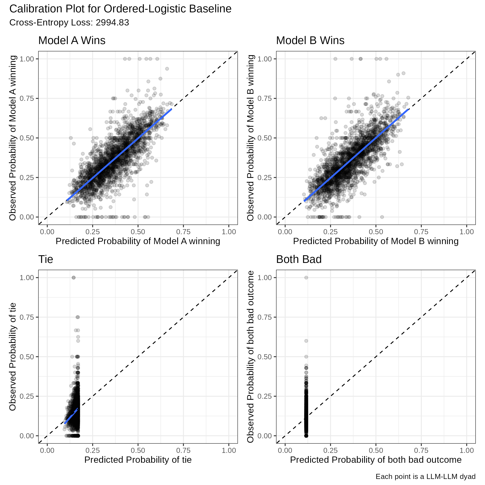
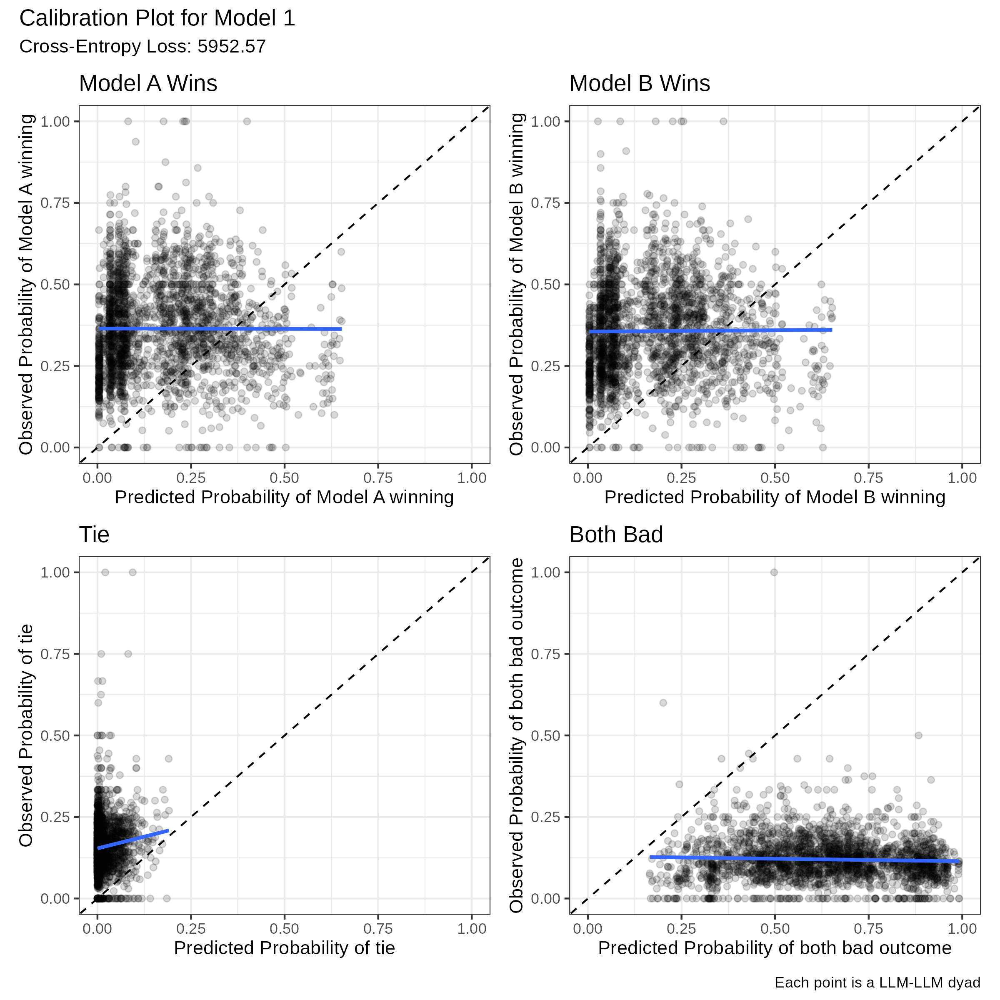
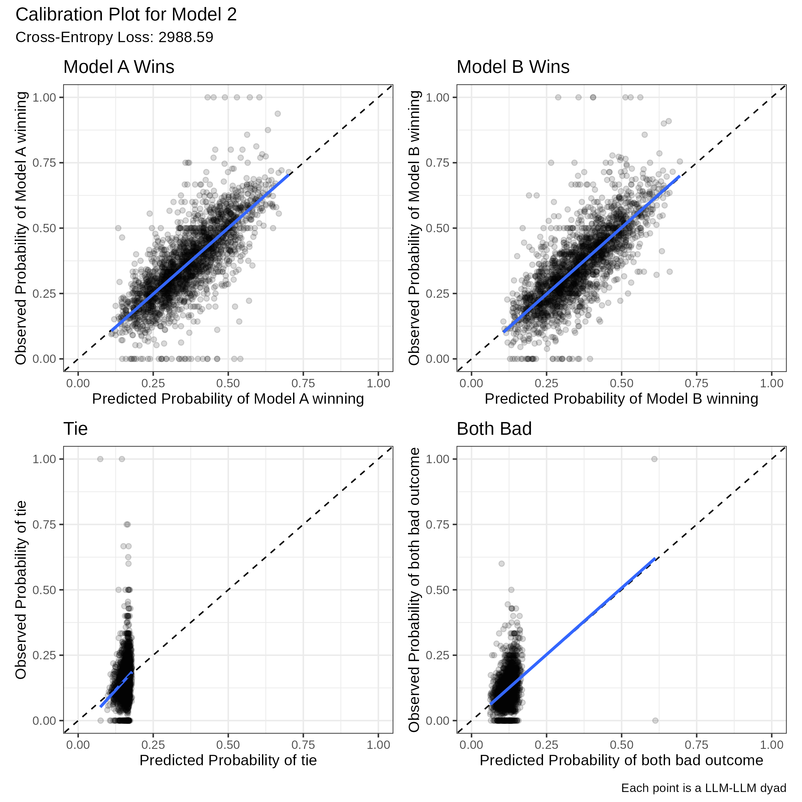
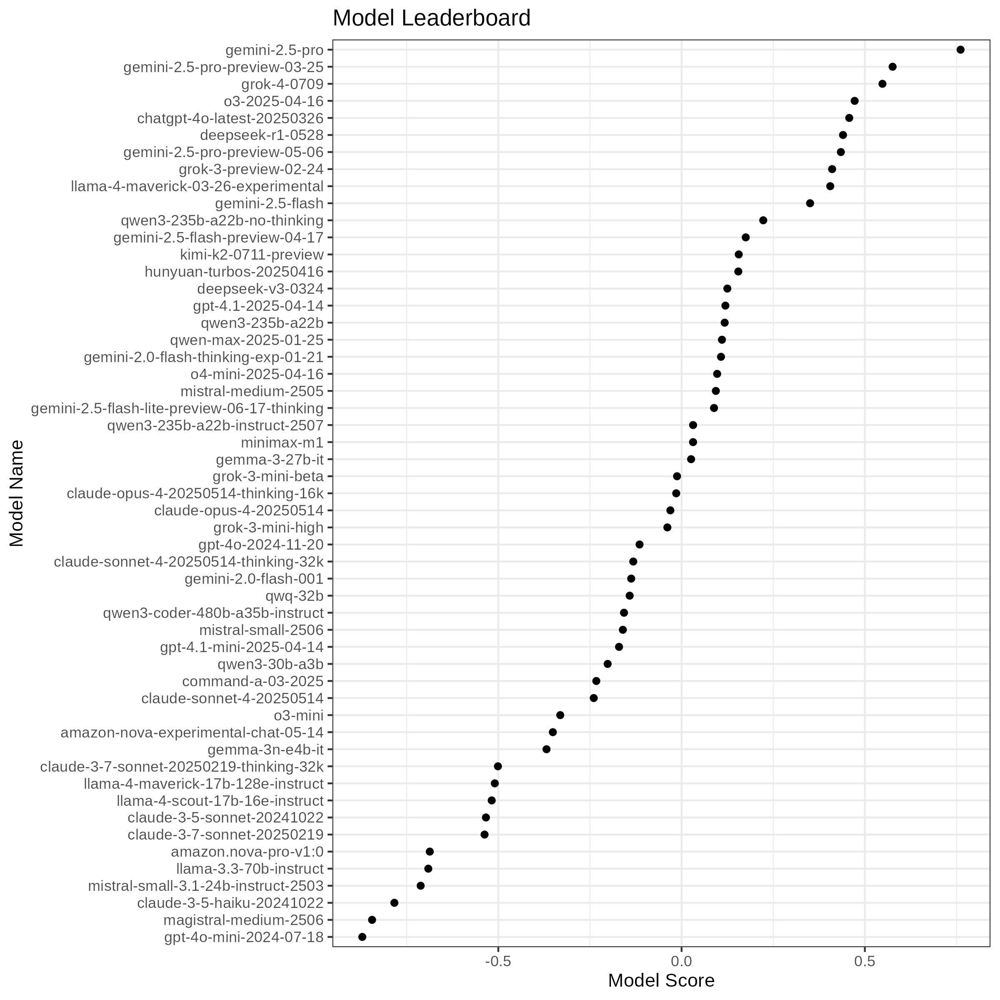

```{r, echo = F, message = F, include = F}
library(arrow)
library(tidyverse)
library(knitr)
library(dplyr)

opts_chunk$set(cache=TRUE, echo = F)

files <- c(
   "/Users/ivansinyavin/Documents/Case Studies/Week 5/train-00000-of-00007.parquet",
   "/Users/ivansinyavin/Documents/Case Studies/Week 5/train-00001-of-00007.parquet",
   "/Users/ivansinyavin/Documents/Case Studies/Week 5/train-00002-of-00007.parquet",
   "/Users/ivansinyavin/Documents/Case Studies/Week 5/train-00003-of-00007.parquet",
   "/Users/ivansinyavin/Documents/Case Studies/Week 5/train-00004-of-00007.parquet",
 "/Users/ivansinyavin/Documents/Case Studies/Week 5/train-00005-of-00007.parquet",
 "/Users/ivansinyavin/Documents/Case Studies/Week 5/train-00006-of-00007.parquet"
  )

#files <- list.files(pattern="*.parquet")

x <- open_dataset(files) %>% 
  select(id, model_a, model_b, winner, category_tag) %>% 
  as.data.frame()

# dim(x)
# head(x[, 1:4])
saveRDS(x, file = 'chatbot.data.rds')
rm(list = ls())
x <- readRDS(file = 'chatbot.data.rds')
# dim(x)
# head(x[, 1:4])
```

# Introduction

In this report, we document our process of modelling the lm arena matchup data. We begin with a Bradley-Terry model which provides a basic leaderboard that ignores matches that end in a tie or a both-bad outcome. We then consider a series of mutlinomial logistic regressions which are able to accurately predict each outcome, but do not provide interpretable rankings of the LLMs. Finally, we develop and fit a series of models that can provide both a ranking of models while predicting each of the four outcomes.

# Bradley Terry Model

We start simple. Only looking at win, loss outcomes, we fit a simple Bradley Terry model, which assigns each model $j$ an underlying ability parameter $\lambda_j$. When two models $i$ and $j$ are compared, the model assumes

$$
P(i \text{ beats } j)
=
\frac{\exp(\lambda_i)}{\exp(\lambda_i) + \exp(\lambda_j)}
=
\operatorname{logit}^{-1}(\lambda_i - \lambda_j).
$$

In this model, the probability of one opponent beating another are determined
entirely by the difference in their unobserved abilities. A higher $\lambda_i$
makes model $i$ more likely to win against any opponent. 

This model can be estimated using a GLM with a bespoke predictor matrix
$X_{\text{reduced}}$, which has one row for each obervation in our dataset, and
$m-1$ columns, where $m$ is the number of models in our dataset. 

We construct $X_{\text{reduced}}$ by first creating a $m \times n$ matrix $X$, which is definied entrywise as: 

$$
X_(i,j)=
\begin{cases}
  1 \quad \text{if model j is the first player in round i}\\
  -1 \quad \text{if model j is the second player in round i}\\
  0\quad \text{otherwise}
\end{cases}
$$

We then remove the first column of $X$ for identifiability to obtain
$X_{\text{reduced}}$. With the predictor matrix created, we can then estimate
the Bradley-Terry model we estimate the ability parameters using a glm with a
logistic link function, where the outcome is modeled as $y_i \sim
\text{Bernoulli}(p_i)$ where $\text{logit}(p_i) = X_{i} \, \beta.$ The
estimated coefficients $\hat\beta$ are the abilities: $\hat\lambda_1 = 0,$
$\hat\lambda_j = \hat\beta_{j-1}$.


```{r, echo = F}
x_bt <- x %>%
  filter(winner %in% c("model_a", "model_b"), model_a != model_b) %>%
  mutate(y = ifelse(winner == "model_a", 1, 0))  

players <- sort(unique(c(x_bt$model_a, x_bt$model_b)))
J <- length(players)
X <- matrix(0, nrow = nrow(x_bt), ncol = J,
            dimnames = list(NULL, players))
for (i in seq_len(nrow(x_bt))) {
  p1 <- x_bt$model_a[i]
  p2 <- x_bt$model_b[i]
  X[i, p1] <- 1
  X[i, p2] <- -1
}
X_reduced <- X[, -1, drop = FALSE]
colnames(X_reduced) <- paste0("abil_", players[-1])
bt_df <- cbind(y = x_bt$y, as.data.frame(X_reduced))
bt_glm <- glm(y ~ . - 1, data = bt_df, family = binomial())
##summary(bt_glm)

```

We then extract from the glm each model’s estimated ability, and the standard
error associated with this estimate, to form a confidence interval. The models
are sorted by decreasing ability, which serves a rank. This produces the a
Bradley--Terry leaderboard. Confidence intervals and ability estimates are
calculated with respect to the `amazon-nova-experimental` model, which is held
out as a reference category.

```{r, fig.height = 7, echo = F, fig.pos = "H"}
beta_hat <- coef(bt_glm)               
abilities <- c(0, unname(beta_hat))     
names(abilities) <- players

V_beta <- vcov(bt_glm)

V_full <- matrix(0, nrow = J, ncol = J)
V_full[-1, -1] <- V_beta
colnames(V_full) <- rownames(V_full) <- players

se_abilities <- sqrt(diag(V_full))
z_crit <- 1.96

leaderboard <- tibble(model   = players, ability = abilities, `s.e.` = se_abilities,
  lwr = ability - z_crit * `s.e.`, upr = ability + z_crit * `s.e.`
) %>%
  arrange(desc(ability)) %>%
  mutate(rank = row_number()) %>%
  select(rank, model, ability, `s.e.`, lwr, upr)


leaderboard %>% 
  ggplot(aes(x= reorder(model, ability), y = ability)) + 
    geom_point() + 
    geom_linerange(aes(ymin=lwr, ymax = upr)) + 
    coord_flip() + 
    theme_bw() + 
    ylab("Estimated Ability Score") + 
    xlab("Model") + 
    ggtitle(
    "Estimated Model Rankings (Best to Worst)", 
    subtitle = "Bradley-Terry Model"
  )
```

This model is a good starting point. It can be used to rank the relative
performance of the models, and it can accurately predict the outcomes of games
that end in either LLM winning. The main drawback it is not able to provide
probabilities over all outcomes, and it does not incorporate information from
games that end in ties or both-bad outcomes, which may also reveal something
about the 'skill' of each LLM.

```{r, figure.width=6, fig.height=6}

nd_all <- expand.grid(
  player1 = players,
  player2 = players,
  KEEP.OUT.ATTRS = FALSE,
  stringsAsFactors = FALSE
) %>%
  dplyr::filter(player1 != player2)

matchups_ordered <- nd_all %>%
  rowwise() %>%
  mutate(
    eta = abilities[player1] - abilities[player2],
    p_player1_wins = plogis(eta)
  ) %>%
  ungroup() %>%
  select(player1, player2, p_player1_wins)

big_grid <- expand.grid(
  row_model = players,
  col_model = players,
  stringsAsFactors = FALSE,
  KEEP.OUT.ATTRS = FALSE
) %>%
  dplyr::filter(row_model != col_model) %>%
  left_join(
    matchups_ordered,
    by = c("row_model" = "player1", "col_model" = "player2")
  ) %>%
  mutate(
    p_left_wins  = 1 - p_player1_wins,
    p_top_wins   = p_player1_wins,
    p_tie        = 0,
    p_both_lose  = 0
  ) %>%
  tidyr::pivot_longer(
    cols = c(p_left_wins, p_top_wins, p_tie, p_both_lose),
    names_to = "outcome",
    values_to = "prob"
  )

players_ordered_full <- leaderboard %>%
  arrange(desc(ability)) %>%
  pull(model)

top5    <- head(players_ordered_full, 5)  
bottom5 <- tail(players_ordered_full, 5)   

sub_players   <- c(top5, bottom5) |> unique()
row_col_order <- players_ordered_full[players_ordered_full %in% sub_players]

big_grid_sub <- big_grid %>%
  filter(row_model %in% row_col_order,
         col_model %in% row_col_order)

big_grid_plot_sub <- big_grid_sub %>%
  mutate(
    row_idx = match(row_model, row_col_order),
    col_idx = match(col_model, row_col_order),
    sub_row = case_when(
      outcome %in% c("p_left_wins", "p_top_wins") ~ 1L,
      TRUE                                         ~ 2L
    ),
    sub_col = case_when(
      outcome %in% c("p_left_wins", "p_tie") ~ 1L,
      TRUE                                   ~ 2L
    ),
    x = (col_idx - 1) * 2 + sub_col,
    y = (row_idx - 1) * 2 + sub_row,
    outcome_label = case_when(
      outcome == "p_top_wins" ~ "Top wins",outcome == "p_left_wins" ~ "Left wins",
      outcome == "p_tie"~ "Tie", outcome == "p_both_lose"  ~ "Both lose"
    )
  )

J_sub <- length(row_col_order)

ggplot(big_grid_plot_sub, aes(x = x, y = y, fill = prob)) +
  geom_tile(color = "white", linewidth = 0.1) +
  geom_text(aes(label = sprintf("%.2f", prob)), size = 2) +
  coord_fixed() +
  scale_fill_gradientn(
    colours = c("grey85", "yellow", "red"),
    values = scales::rescale(c(0, 0.5, 1))) +
  scale_x_continuous(
    breaks = (2 * (1:J_sub)) - 0.5, labels = row_col_order, expand = c(0, 0)) +
  scale_y_reverse(
    breaks = (2 * (1:J_sub)) - 0.5, labels = row_col_order,expand = c(0, 0)) +
  labs(
    x = "Models",
    y = "Models",
    fill = "Probability",
    title = "Bradley–Terry pairwise probabilities (for top 5 and bottom 5 models)",
    subtitle = "For Each Matchup: TL (top left)=row model wins, TR = column model wins, BL=tie, BR=both lose."
  ) +
  theme_minimal(base_size = 9) +
  theme(
    panel.grid = element_blank(),
    axis.text.x = element_text(angle = 90, vjust = 0.5, hjust = 1),
     plot.title = element_text(hjust = 0.6, face = "bold"),
  plot.subtitle = element_text(hjust = 0.6)
  )

```

# Multinomial Regression Model 

Because the simple model can't generate predictions for all outcomes, we try to
create predictions for the probability of tying and the 'both bad outcomes' via
multinomial regressions. In these models, we treat each possible outcome
matchup---$A$ win, $B$ win, tie, or both\_bad---as its own binary event. For
each outcome $k \in \{\text{A},\text{B},\text{tie},\text{bad}\}$ we fit a
logistic model 

$$
\text{logit}\big( P(y_k = 1 \mid \text{models } i,j) \big)
= \beta^{(k)}_0 + \beta^{(k)}_i - \beta^{(k)}_j.
$$

Each set of parameters $\beta^{(k)}$ describes how strong each model is with respect to outcome $k$. For example, large $\beta^{(A)}_i$ means model $i$ tends to produce $A$ wins, large $\beta^{(\text{tie})}_i$ means model $i$ tends to generate ties, and so on. 

When we pair two models $(i,j)$, each logistic regression produces a linear predictor

$$
\eta_k = \widehat{\beta}^{(k)}_0 + \widehat{\beta}^{(k)}_i - \widehat{\beta}^{(k)}_j,
\qquad k \in \{\text{A},\text{B},\text{tie},\text{bad}\}.
$$

To convert these four logits into a valid probability distribution over outcomes, we exponentiate and normalize:

$$
p_k = \frac{e^{\eta_k}}
           {e^{\eta_A} + e^{\eta_B} + e^{\eta_{\rm tie}} + e^{\eta_{\rm bad}}},
\qquad k \in \{\text{A},\text{B},\text{tie},\text{bad}\}.
$$

These probabilities satisfy $p_A + p_B + p_{\rm tie} + p_{\rm bad} = 1,$ so for every ordered matchup $(i,j)$ the model returns a full probability distribution over the four possible outcomes.


```{r,fig.height=10}
x_mn <- x %>%
  filter(model_a != model_b) %>%
  mutate(
    outcome = case_when(winner == "model_a" ~ "A_win", winner == "model_b" ~ "B_win", winner == "tie" ~ "tie", winner == "both_bad" ~ "both_bad")
  ) %>%
  filter(!is.na(outcome))

players <- sort(unique(c(x_mn$model_a, x_mn$model_b)))

x_mn <- x_mn %>%
  mutate(player1 = factor(model_a, levels = players), player2 = factor(model_b, levels = players))

X1 <- model.matrix(~ player1 - 1, data = x_mn)
X2 <- model.matrix(~ player2 - 1, data = x_mn)
Z  <- X1 - X2

Z  <- Z[, -1, drop = FALSE]
colnames(Z) <- paste0("theta_", players[-1])

df <- as.data.frame(Z)
df$outcome <- factor(df$outcome <- x_mn$outcome, levels = c("A_win", "B_win", "tie", "both_bad"))

y_A    <- as.integer(df$outcome == "A_win")
y_B    <- as.integer(df$outcome == "B_win")
y_Tie  <- as.integer(df$outcome == "tie")
y_BBad <- as.integer(df$outcome == "both_bad")

predictors_df <- transform(df, outcome = NULL)

fit_A    <- glm(y_A ~ ., data = predictors_df, family = binomial())
fit_B    <- glm(y_B ~ ., data = predictors_df, family = binomial())
fit_Tie  <- glm(y_Tie ~ ., data = predictors_df, family = binomial())
fit_BBad <- glm(y_BBad ~ ., data = predictors_df, family = binomial())

#summary(fit_A); summary(fit_B); summary(fit_Tie); summary(fit_BBad)

make_Z_row <- function(p1, p2, players) {
  v1 <- rep(0, length(players)); v2 <- rep(0, length(players))
  names(v1) <- names(v2) <- players
  v1[p1] <-  1
  v2[p2] <- -1
  z <- v1 + v2           
  z_reduced <- z[-1]    
  names(z_reduced) <- paste0("theta_", players[-1])
  as.data.frame(t(z_reduced))
}

all_pairs <- expand.grid(player1 = players, player2 = players,
                         stringsAsFactors = FALSE) %>%filter(player1 != player2)

Z_new <- do.call(rbind, lapply(seq_len(nrow(all_pairs)), function(k) {
                   make_Z_row(all_pairs$player1[k], all_pairs$player2[k], players)}))

eta_A_new    <- predict(fit_A,    newdata = Z_new, type = "link")
eta_B_new    <- predict(fit_B,    newdata = Z_new, type = "link")
eta_Tie_new  <- predict(fit_Tie,  newdata = Z_new, type = "link")
eta_BBad_new <- predict(fit_BBad, newdata = Z_new, type = "link")

denom <- exp(eta_A_new) + exp(eta_B_new) + exp(eta_Tie_new) + exp(eta_BBad_new)

p_A_new <- exp(eta_A_new) / denom
p_B_new <- exp(eta_B_new) / denom
p_Tie_new  <- exp(eta_Tie_new) / denom
p_BBad_new <- exp(eta_BBad_new)/ denom

```

```{r}
matchups_full <- tibble(
  player1 = all_pairs$player1,
  player2 = all_pairs$player2,
  p_A_win    = p_A_new,
  p_B_win    = p_B_new,
  p_Tie      = p_Tie_new,
  p_BothBad  = p_BBad_new
)
```

```{r, figure.width=6, fig.height=6}
players_ordered_full <- leaderboard %>%
  arrange(desc(ability)) %>%
  pull(model)

top5    <- head(players_ordered_full, 5)   
bottom5 <- tail(players_ordered_full, 5)  
sub_players   <- c(top5, bottom5) |> unique()
row_col_order <- players_ordered_full[players_ordered_full %in% sub_players]

pair_grid_mn <- expand.grid(
  row_model = row_col_order,
  col_model = row_col_order,
  stringsAsFactors = FALSE,
  KEEP.OUT.ATTRS = FALSE
) %>%
  filter(row_model != col_model) %>%
  left_join(matchups_full, by = c("row_model" = "player1", "col_model" = "player2")
  )

big_grid_mn <- pair_grid_mn %>%
  mutate(
    p_left_win = p_A_win,p_top_win  = p_B_win,p_tie = p_Tie,p_bad= p_BothBad
  ) %>%
  pivot_longer(cols = c(p_left_win, p_top_win, p_tie, p_bad),names_to = "outcome", values_to = "prob"
  ) %>%
  mutate(
    sub_row = case_when(outcome %in% c("p_left_win", "p_top_win") ~ 1L, TRUE ~ 2L),
    sub_col = case_when(outcome %in% c("p_left_win", "p_tie") ~ 1L,TRUE ~ 2L),
    row_idx = match(row_model, row_col_order),
    col_idx = match(col_model, row_col_order),
    x = (col_idx - 1) * 2 + sub_col,
    y = (row_idx - 1) * 2 + sub_row
  )

J_sub <- length(row_col_order)

ggplot(big_grid_mn, aes(x = x, y = y, fill = prob)) +
  geom_tile(color = "white", linewidth = 0.1) +
  geom_text(aes(label = sprintf("%.2f", prob)), size = 2) +
  coord_fixed() +
scale_fill_gradientn(
  colours = c("grey85", "yellow", "red"),
  values = scales::rescale(c(0, 0.5, 1))
)+
  scale_x_continuous(breaks = (2 * (1:J_sub)) - 0.5, labels = row_col_order,expand = c(0, 0)) +
  scale_y_reverse(breaks = (2 * (1:J_sub)) - 0.5,labels = row_col_order,expand = c(0, 0)) +
  labs(
    x = "Models (columns, ranked by simple BT)",
    y = "Models (rows, ranked by simple BT)",
    fill = "Probability",
    title = "Pairwise outcome probabilities (for top 5 and bottom 5 by BT ability)",
    subtitle = "For each matchup: TL (top left) =row model wins, TR= column model wins, BL=tie, BR=both bad."
  ) +
  theme_minimal(base_size = 9) +
  theme(
    panel.grid = element_blank(),
    axis.text.x = element_text(angle = 90, vjust = 0.5, hjust = 1),
      plot.title    = element_text(hjust = 0.6, face = "bold"),
     plot.subtitle = element_text(hjust = 0.6)
  )
```

# Flagship Models - Ordered Logistic + Both-Bad Outcomes

So far, we have created models that are able to provide rankings for the units
and seperate models that were able to predict all four outcomes. In this
section, we synthesize the two and create a series of models that are able to
accurately predict all outcomes and also provide an interpretable leaderboard.

Our main idea in developing this model was to assume that the games are played
roughly as follows:

1. Each model flips an (unobserved) biased coin which determines if they will
   fail (these failures could be from failing to understand the prompt, or by
giving a answer non-responsive to the question asked). 
2. If assumming the models do not make an error, a game is played to a win,
   loose, or tie outcome which we observe.

This corresponds to a measurement error model in which the outcome of games is
sometimes not reported because the performance of each mode does not cross a
certain threshold. 

We assume that the probability of wins, losses, and ties can
be well-described by an ordered logistic regression model, which performs well
fit to a dataset that exludes the 'both-bad' outcomes. Formally, for two models
$i$ and $j$, we model the probaility of each outcome as: 

\begin{equation}
\begin{split}
  P(i \text{ beats } j | ! \text{both bad}) &=  1-\text{logit}^{-1]}(\lambda_i - \lambda_j - c_1) \\
  P(i \text{ ties } j | ! \text{both bad}) &=   \text{logit}^{-1]}(\lambda_i - \lambda_j - c_2) \\
  P(j \text{ beats  } i | ! \text{both bad}) &=  P(i \text{ beats } j | ! \text{both bad}) -  P(i \text{ ties } j | ! \text{both bad})
\end{split}
\end{equation}

Where $c_1$, $c_2$ are two cutpoint parameters that are also estimated when
fitting the model. These cutpoints help determine the relative difficulty of
tying vs winning for two closely-matched opponents. If $c_1$ and $c_2$ are very
close to each other, then it will be very difficult for models to tie as ties
are very unlikely. When $c_1$ and $c_2$ are far apart, it will be much easier
for ties to occur. 


Across both models, we assume that each model $i$ has an indepent chance of a
'faliure', which can lead to a 'both-bad' outcome, interfering with our
observation. Specifically, for each game, each model flips a baised coin with
probaility of heads $\rho_i$ to get an indicator variable $F_i$, which
determines how their outcome is observed. We consider two ways in which these
failiures could create a 'both-bad' outcome: 

1. In model 1, a failure makes an LLM ineligible to win this round. We observe 'both-bad' if both models fail
2. In model 2, either model can derail the competition. If either model fails, we observe the 'both-bad' outcome.

We discuss these two models in more detail below.

#### Model 1:

In model 1, we assume that a player failing means they are inelligble to win.
Thus, if neither model fails, then the observed outcome is $Y_{ij}$. If either
fails and the other does not, then their opponent wins. Finally, if both models
fail, then the 'both-bad' outcome is observed. This logic is summarized below:

$$
Y^\text{observed}_{ij} = 
\begin{cases}
Y_{ij} \quad \quad  (F_i \neq 1) \& (F_j \neq 1) \\
\text{A wins} \quad  \quad (F_i \neq 1) \& (F_j = 1) \\
\text{B wins} \quad  \quad (F_i = 1) \& (F_j \neq 1) \\
\text{both bad} \quad  \quad (F_i = 1) \& (F_j = 1)\\
\end{cases}
$$

#### Model 2:

In model 2, we keep the failure probabilities, but assume that a failure from
either model simply derails the competition and forces a 'both-bad' outcome.

$$
Y^\text{observed}_{ij} = 
\begin{cases}
Y_{ij} \quad \quad  (F_i \neq 1) \& (F_j \neq 1) \\
\text{both bad} \quad  \quad \text{otherwise}
\end{cases}
$$

#### Estimation and Inference

We calculate the likelihood with the law of total probability: 

$$
P(Y^\text{observed}_{ij} | \lambda, c,\rho) = P(Y_{ij} | \lambda, c , \rho)P(!\text{both bad} | \lambda, c, \rho) + P(\text{both bad} | \lambda, c, \rho)
$$


The expression $P(\text{both bad} | \lambda, c, \rho)$ is computed by
marginalizing over $F_i$ and $F_j$ which must be done seperately for each
model, as the different rules for determining whether a both-bad outcome occurs
imply different probabilities of both-bad for a given $\lambda, c, and \rho$ 

We code all of these models in the STAN programming language, which provides
automatic differentiation and allows for efficient optimization of the models.
All estimates reported are maximum a posteriori estimates obtained after
placing $\mathcal{N}(0,2)$ priors on $\lambda$ and $c$, although the results
are substantially identical when estimating via maximum likelihood.

### Model Assessment

In this section, we assess the performance of each model using a series of
calibration plots and the cross-entropy loss when predicting the outcome of
each match. The cross-entropy loss describes how well the model does when
predicting the outcome of each match. High-cross entropy loss suggests that the
model does assigns very low probability to the observed outcome of each match,
while a low-cross entropy loss suggests that the model assigns high probability
to observed outcomes

We evaluate both of these models relative to a baseline ordered logistic
regression model which assumes that the both-bad outcome happens with a fixed
probability common to every matchup. We display the cross-entropy loss and
calibration plots for this baseline model below.


The dashed 45-degree lines on each plot show perfect calibration, while the
blue line shows a linear regression of the actual frequency of an outcome
observed within a dyad on the predicted probability of the outcome from the
model.

#### Model 1

The first model is theoretically-plausible, but it does not describe the data
well. Specifically, the MAP solution drastically overstates the probability of
a 'both-bad' outcome, and the predictions perform worse (as measured by
cross-entropy loss) than our ordered-logistic baseline, and worse even than a
naive baseline that assumes every model has the same chance of winning, tying,
loosing or the both-bad outcome. Because of this, we do not proceed further
with this model.



#### Model 2

The second model lines up worse with our expectations of how the prompt
responses are scored, but it has excellent predictive performance. This model
performs better the ordered-logistic baseline that assumes a constant global
probability of failure common to all units, and provides well-calibrated
predictions for the match results. 

The cross-entropy loss is lower than the ordered-logistic baseline, but the
differences are not massive (2988 v.s. 2994), this is likely because the models
should provide identical predictions conditional on the 'both-bad' outcomes not
happening, so all improvements in cross-entropy loss must come from
improvements in accurately predicting this (relatively rare) outcome.




#### Leaderboard Produced by Flagship Model: 



The ordering of these models are substantially identical to our basic
Bradley-terry model that ignores tie outcomes and the 'both-bad' outcomes. The
'podium' top-3 models are the same, as are the worst-performing models.  There
are some slight differences in positioning between models that have almost
identical scores, but these differences are not statistically meaningful.

The only difference is that the scores from the Bayesian model are mean-zero,
while the estimates from the Bradley-terry model are estimated relative to the
held-out Amazon model. However, these differences are not relevant when
computing a ranking of the models.


## Conclusion

In this report, we have considered several strategies for predicting the
outcomes of each LLM matchup, and for quantifying the skill of each model. Our
best-performing predictive model uses a ordered-logistic model to predict the
outcomes of games that do not end in a 'both-bad' outcome, but assumes that
each of the models has an indepenent chance of derailing the matchup and
forcing a 'both-bad' outcome. We report predictions and leaderboard rankings
from this model, but our estimates of model performance are subsantially
identical across all the modelling strategies we test.
